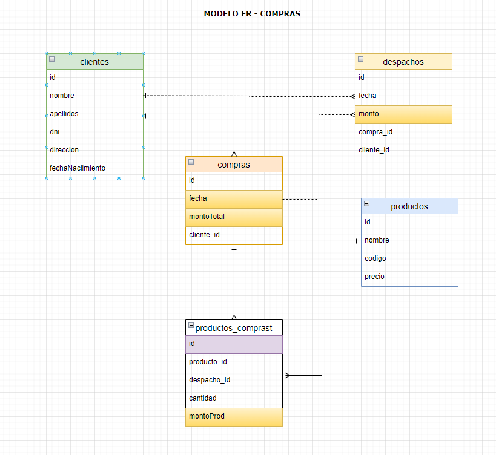

# Registro Masivo de Productos en Multivende y Otras Funcionalidades

## Descripción
Este proyecto implementa una serie de APIs para diversas funcionalidades en el contexto de un sistema de ventas en línea llamado Multivende. Una de las funcionalidades principales es el registro masivo de productos, utilizando un sistema de colas Rabbit MQ para gestionar eficientemente la alta carga de registros, incluso superando los 50,000 productos. Además, se han implementado APIs para filtrar personas que no tienen dirección y ordenarlas de manera ascendente, así como filtrar personas de 20 a 30 años cuyos nombres comienzan con las letras "H" y "L". También se ha desarrollado una API para filtrar la asociación de un email con un usuario, así como para identificar emails no válidos. Finalmente, se ha diseñado un modelo de base de datos entidad-relación del proceso de compras requeridos.

## Contexto
Multivende es un sistema de ventas en línea que busca ofrecer una plataforma eficiente y completa para vendedores y compradores. Para lograr esto, es fundamental contar con funcionalidades que faciliten la gestión de productos, la interacción con los clientes y la validación de la información ingresada en el sistema.

## Requerimientos Técnicos
- Desarrollo Backend: Node.js, Express.js
- Base de Datos: Mysql
- Sistema de colas: Rabbit MQ
- Contenedorización: Docker

## Instalación
1. Clona este repositorio: `git clone https://github.com/nelsonstos/reg-masivo-productoss-multivende.git`
2. Instala las dependencias: `npm install`

## Configuración
1. Crea un archivo `.env` en la raíz del proyecto y configura las variables de entorno necesarias utilizando el archivo `.env.example` como referencia. 

## Uso
1. Ejecuta el servidor: `npm run dev`

## Ejemplo de API
### Productos
- `POST /api/v1/products`: Registro masivo de productos.
- Parámetros de la solicitud:
 ```json
  {
      "name": "Proceso de registro masivo de productos",
      "authorizationCode": "ac-79aca336-8a38-4602-8f61-5b966d5b0114",
      "totalProducts": 70000,
      "batchSize": 1000
      
  }
 ```
- Respuesta exitosa:
 ```json
 {
    "statusCode": 200,
    "data": {
        "product": {
            "name": "Proceso de registro masivo de productos",
            "total": 70000,
            "authorizationCode": "ac-79aca336-8a38-4602-8f61-5b966d5b0114",
            "status": "SENT"
        }
    },
    "message": "Mass registration of products has been executed successfully!"
}
 ```
### Personas
- `GET /api/v1/persons?noaddress=true&order=asc`: Obtiene datos de personas sin dirección y/o ordenados ascendentemente.
- Respuesta exitosa:
 ```json
{
    "statusCode": 200,
    "data": {
        "persons": [{
            "_id": "6143acfaf12d437d811b3f18",
            "index": 0,
            "guid": "6b766493-72b7-4363-b21d-5edc27e758ca",
            "isActive": false,
            "balance": "$2,561.70",
            "picture": "http://placehold.it/32x32",
            "age": 29,
            "eyeColor": "green",
            "name": "Keisha Anderson"
            
        }
      ]
    },
    "message": "filtered persons withouth address successfully!"
}
 ```

- `GET /api/v1/persons?age=20-30&startsWith=H,L`: Obtiene datos de personas con edades entre 20 y 30 años con iniciales de nombre H y L .
- Respuesta exitosa:
 ```json
{
    "statusCode": 200,
    "data": {
        "persons": [{
            "_id": "6143acfac41a2d999ba6b901",
            "index": 11,
            "guid": "cf816cce-2969-4e17-83fd-78c6de234fa9",
            "isActive": false,
            "balance": "$2,335.48",
            "picture": "http://placehold.it/32x32",
            "age": 21,
            "eyeColor": "brown",
            "name": "Heather Dickerson",
            
        }
      ]
    },
    "message": "filtered persons withouth address successfully!"
}
 ```
### Emails
 - `GET /api/v1/emails?type=noValidos`: Filtra supuestos emails según el valor de params type, el valor de type es el siguiente : validos, noValidos y sinPersona .
- Respuesta exitosa:
 ```json
{
    "statusCode": 200,
    "data": {
        "emails": [
            "a",
            "a.com",
            "a.",
            "test@ma"
        ]
    },
    "message": "Emails successfully filtered!"
}
 ```
## Otros
Diseño de un modelo de base de datos entidad-relación del proceso de compras 


## Contribución
Si deseas contribuir a este proyecto, sigue estos pasos:
1. Haz un fork del repositorio
2. Crea una nueva rama: `git checkout -b feature-nueva`
3. Realiza tus cambios y haz commit: `git commit -am 'Agrega una nueva característica'`
4. Haz push a la rama: `git push origin feature-nueva`
5. Envía un pull request


